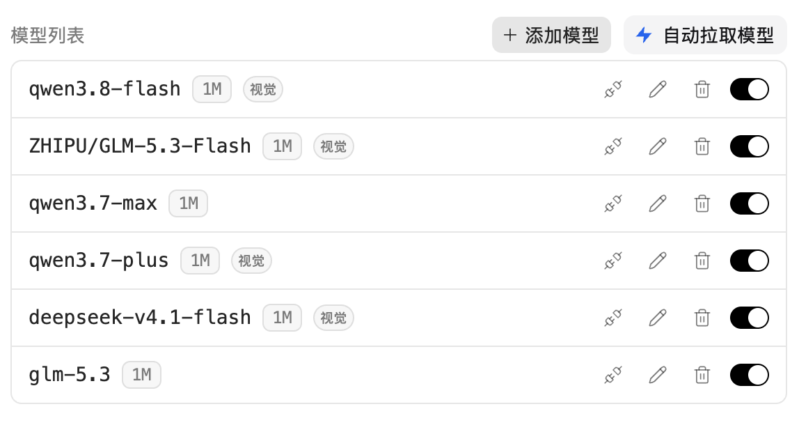
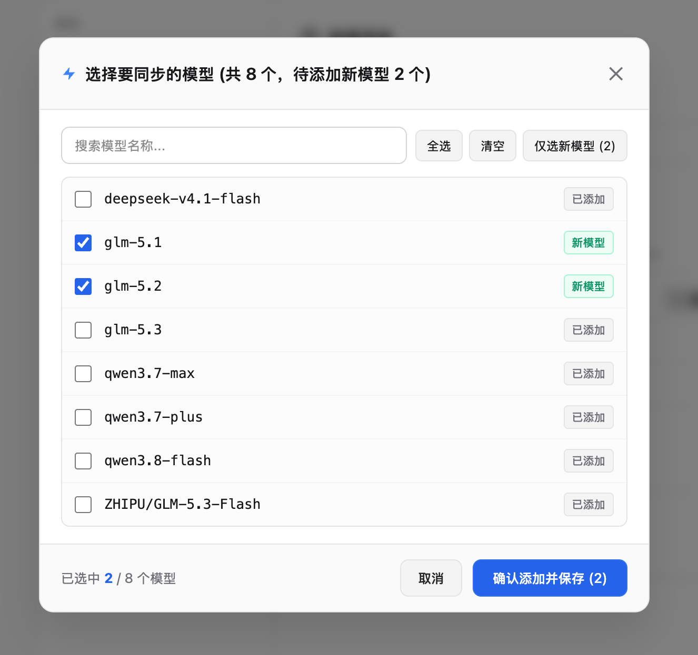

# ⚡️ ZCode Model Puller (ZCode 自定义模型自动拉取与同步工具)

<p align="center">
  <b>一键为 ZCode 客户端注入「自动拉取模型」能力，告别繁琐的手动输入！</b>
  <br />
  自动探测 API 可用模型 · 智能比对已有模型 · 原生按钮样式 · 白天/夜间主题自适应 · 升级后自动重装 · 0 破坏性风险
</p>

<p align="center">
  
  
  
</p>

---

## 📸 界面效果预览

### 1. 深度融入原生界面的按钮与自动刷新列表
> 在原有「+ 添加模型」右侧新增「**⚡️ 自动拉取模型**」按钮，尺寸/圆角/字号自动对齐官方按钮，与原生界面同族；拉取并保存后，所有模型卡片**秒级自动呈现在列表中**，无需手动刷新！

<p align="center">
  
</p>

---

### 2. 智能比对模型与白天/暗黑主题自适应弹窗
> 智能区分「已添加」与「未添加」模型，已存在的模型自动识别并取消勾选（防重复添加），未添加的新模型自动全选；完美跟随 ZCode 浅色/深色主题！

<p align="center">
  
</p>

---

## 📖 项目背景

[ZCode](https://zcode.z.ai) 是一款强大的 AI 编程桌面客户端，支持配置自定义模型供应商（如 OpenAI 兼容接口、各大中转站、OneAPI、NewAPI、阿里百炼、DeepSeek、Ollama 等）。

但在使用自定义供应商时，官方界面需要用户**一个一个手动点击「+ 添加模型」并逐字输入模型 ID**。当一个供应商支持几十甚至上百个模型时，手动添加极其费时费力。

本项目为解决这一痛点而生：
- 既支持在终端中**一键全自动同步**
- 更支持**无缝将「⚡️ 自动拉取模型」按钮直接注入到 ZCode 软件的设置界面中**！

---

## ✨ 核心亮点

- 🎨 **原生级视觉融合**：
  - 按钮高度、圆角、字号、内边距自动对齐官方「添加模型」按钮，并排收拢显示，不破坏原有排版。
  - **主题完美自适应**：白天/浅色模式下自动呈现原生干净白底，夜间/深色模式下自适应沉稳暗黑风。
- 🔍 **智能精准比对**：
  - 自动识别界面上已展示的模型并标注「**已添加**」（默认不勾选，防重复添加）。
  - 真正未展示的新模型自动标注「**新模型**」（**默认全选**）。
  - 提供「全选 / 清空 / 仅选新模型」快捷按钮与实时搜索过滤。
- ⚡️ **全自动原生刷新**：
  - 点击「确认添加并保存」后，通过安全的 Electron IPC 原生读写配置，并**自动联动官方刷新事件**，新模型卡片即刻展现在列表中，无需手动刷新或切换页面！
- 🛡️ **绝对安全稳定**：
  - 首次注入时自动完整冷备份官方原版 `app.asar`。
  - 提供一键卸载还原脚本，随时可秒级恢复出厂状态。
- 🔁 **更新后自动重装**：
  - 内置更新守护（macOS LaunchAgent），监听 ZCode 应用包变化，**客户端升级后自动重新注入**并弹出系统通知，无需手动重装。
- 🌐 **免 CORS 跨域限制**：
  - 完美兼容所有第三方中转平台、代理站与私有模型服务。

---

## 🚀 快速开始

### 方式一：克隆仓库并一键安装（推荐）

```bash
# 1. 克隆本项目
git clone https://github.com/HHQ-666/zcode-model-puller.git
cd zcode-model-puller

# 2. 运行一键安装脚本
./install.sh
```

> 安装完成后，按 `Command + Q` 完全退出并重新打开 **ZCode** 客户端，进入「设置 -> 模型设置 -> 自定义供应商」，即可看到全新的「**⚡️ 自动拉取模型**」按钮！
>
> 安装脚本会同时启用更新守护：以后 ZCode 升级时会自动重新注入（弹系统通知提示重启）；若不需要，用 `./install.sh --no-watch`。

---

### 方式二：命令行独立使用（无需修改任何软件）

如果你不想注入任何客户端界面代码，也可以直接使用内置的 CLI 工具：

```bash
cd zcode-model-puller
python3 run.py --sync
```
终端将自动列出所有在 ZCode 中配置的自定义供应商，选择编号即可一键批量拉取并同步写入配置！

---

## 🔄 一键卸载与还原

如果你想随时卸载注入，完全恢复 ZCode 官方原版：

```bash
cd zcode-model-puller
./uninstall.sh
```

---

## 📂 项目结构

```text
zcode-model-puller/
├── assets/                # 效果预览截图
├── run.py                 # 总控制台入口
├── zcode_sync.py          # 核心模型探测与 CLI 同步引擎
├── inject_tool.py         # 客户端打包、安全注入与还原引擎
├── zcode-model-puller.js  # 注入到 ZCode 前端的 UI 与交互脚本
├── watch_reinstall.py     # 更新守护：检测到 ZCode 升级后自动重新注入
├── watch_agent.py         # 守护的 launchd 安装 / 卸载 / 状态查看
├── install.sh             # 一键安装脚本
├── uninstall.sh           # 一键卸载与还原脚本
├── LICENSE                # MIT 开源协议
└── README.md              # 项目详细说明文档
```

---

## 🛠️ 技术原理

1. **资源解构与打包**：使用 `@electron/asar` 解包与重构 ZCode 客户端应用包；
2. **进程间通信（IPC）桥梁**：在 Electron 主进程（Main Process）与预加载脚本（Preload Script）中注册原生安全通道，绕过 Chromium 浏览器的跨域拦截与沙箱权限限制；
3. **前端 DOM 监听与注入**：使用 `MutationObserver` 监听设置页面的 DOM 节点挂载，在原有「添加模型」按钮旁动态插入「自动拉取模型」组件；
4. **状态同步与事件联动**：通过模拟官方主刷新按钮的点击事件，促使 React 内部状态树重新载入最新的配置文件，达到无需重启软件、列表秒级重绘的流畅效果。

---

##  常见问题

**Q：ZCode 升级之后，界面上的「⚡️ 自动拉取模型」按钮消失了？**

ZCode 每次自动更新都会**整包替换** `app.asar`（连同旧的 `.original.bak` 备份一起清掉），因此注入会失效。

安装时已默认启用**更新守护**：检测到客户端升级后会**自动重新注入**并弹出系统通知，你只需重启一次 ZCode 即可。若需手动处理（或未启用守护），重新执行一次安装即可，无需卸载：

```bash
cd zcode-model-puller
./install.sh          # 重新注入；随后 Command + Q 完全退出再启动
```

> 该安装流程是幂等的，且会在替换前做完整校验（语法校验 + 归档结构校验 + 原生模块解包校验），校验不通过则放弃替换，不会破坏原包。
> 注入器已适配 ZCode 3.12+：供应商配置改从 `~/.zcode/v2/provider_config.json` 读写，注入锚点自动识别，不再因官方压缩变量名变化而失效。

**Q：如何查看或停用更新守护？**

```bash
cd zcode-model-puller
python3 watch_agent.py status    # 查看是否已加载
python3 watch_agent.py remove    # 停用并移除守护（不影响已注入的按钮）
```

> 守护日志：`~/.zcode-model-puller/watch.log`；状态与指纹：`~/.zcode-model-puller/state.json`。
> 安装时加 `--no-watch` 可只注入、不启用守护；手动运行 `install.sh` 与守护互斥，不会重复打包。

**Q：ZCode 3.11 时代写在 `~/.zcode/v2/config.json` 里的供应商配置还有效吗？**

3.12 起自定义供应商统一存放于 `~/.zcode/v2/provider_config.json`，旧文件已不再被客户端读取。本项目（含界面按钮与 CLI 同步）已全部切换到新配置，无需手动迁移。

---

## 📄 开源协议

本项目采用 [MIT License](LICENSE) 开源协议，欢迎 Star、Fork 与提交 Pull Request！
